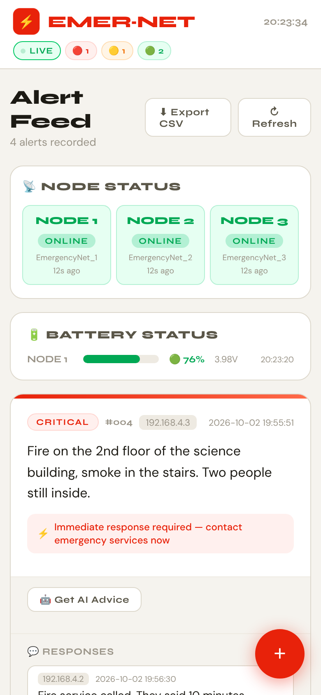
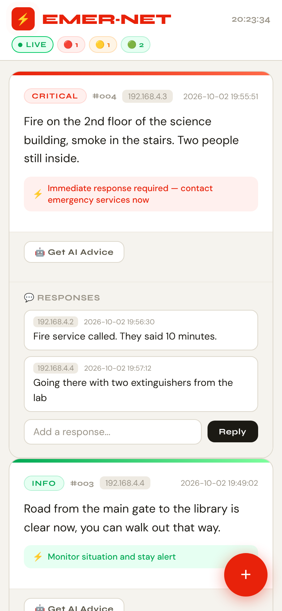
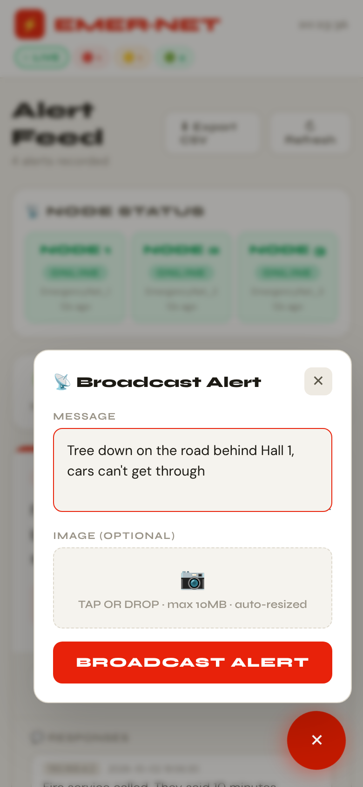
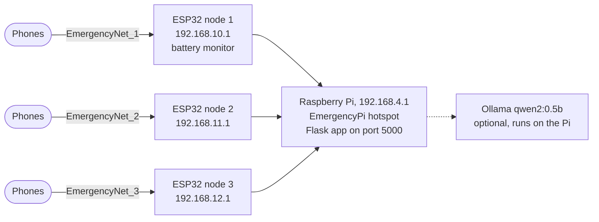

# Emergency Network

An offline emergency alert system made with three ESP32 boards and a Raspberry Pi. It doesn't need internet or a mobile network. You join one of the ESP32 Wi-Fi hotspots with your phone, open a web page, and you can post an alert (with a photo if you want), see everyone else's alerts and reply to them.

I built it as my 5th semester lab project (CSE 518) and tested the whole thing on real hardware, with phones on all three nodes sending alerts to the same Pi.

<p align="center">
  
  
  
</p>
<p align="center"><sub>The web app with some test alerts. Node status and battery, an alert with replies, and sending a new alert.</sub></p>

## Why

During a flood, a cyclone or a big fire, the mobile network and internet often go down, but people in the same building or campus still need to tell each other what's going on. I wanted something you can put together from cheap boards, that runs on its own, and that anyone can use from a phone browser without installing an app.

## How it works



Each ESP32 runs as an access point and a Wi-Fi client at the same time (AP+STA mode). On the AP side it puts up its own hotspot for phones, and each node gets its own subnet (192.168.10.x, 192.168.11.x, 192.168.12.x) so nothing clashes with the Pi's network (192.168.4.x). On the STA side it joins the Pi's hotspot like any other client.

On top of that each node runs a small HTTP server on port 80. Every GET and POST from a phone gets forwarded to the Flask server on the Pi, and the Pi's response is streamed back to the phone in 1 KB chunks. So it doesn't matter which node your phone is on, you get the same page and the same data. Nothing is stored on the ESP32s, only on the Pi.

It's a star network, not a mesh. Every node talks to the Pi directly and doesn't relay for the others, so each one has to be in Wi-Fi range of the Pi.

### What happens when you send an alert

1. You write the message and pick a photo if you want. The browser shrinks the photo before uploading (max 1280 px, then lower JPEG quality until it's under about 48 KB). The server rejects anything over 55 KB. Everything goes through the ESP32 proxy, so keeping files small matters.
2. The phone posts to its node and the node forwards it to the Pi.
3. Flask tags the alert CRITICAL, MODERATE or INFO with a simple keyword check (no internet needed) and adds a suggested action. The alert is saved to `uploads/alerts.txt`.
4. Every phone's page checks for new alerts every 30 seconds, or when you press Refresh. Replies go under each alert and are saved in `uploads/comments.json`. All alerts can also be downloaded as a CSV.

### Keeping track of the nodes

- Every node sends a heartbeat to the Pi every 30 seconds. The start is staggered by node ID so the three boards don't all hit the Pi at the same moment. If nothing comes from a node for 90 seconds, the page shows it as offline.
- If a node loses the Pi, it retries every 3 seconds. After 10 failed tries it waits 30 seconds and starts again. While it's disconnected it answers phones with a 503 error instead of leaving them hanging.
- Node 1 also reports its battery. The Li-ion cell goes through a 10k/10k divider into GPIO34, the firmware averages the last 5 readings, sends the average every 10 seconds and maps 3.3 V to 0% and 4.2 V to 100%. It's the raw ADC with no calibration, so treat the percentage as a rough number.
- The firmware erases NVS on every boot and keeps the Wi-Fi settings in RAM only, so a board never comes up with old credentials from a previous flash. Wi-Fi power save is turned off to keep the proxy responsive.

### AI advice (optional)

Every alert has a "Get AI Advice" button. It asks a small model running on the Pi itself through [Ollama](https://ollama.com) (`qwen2:0.5b`) for 2 to 3 sentences of practical advice for that alert. This also works offline, it's just slow on a Pi (the page says it can take 10 to 20 seconds). The rest of the system works fine without it. To turn it on, install Ollama on the Pi and run `ollama pull qwen2:0.5b` before starting Flask.

## Hardware

- 3 ESP32 dev boards (firmware is ESP-IDF v5.x, I used 5.5.2)
- 1 Raspberry Pi (its onboard Wi-Fi runs the `EmergencyPi` hotspot)
- For node 1 only: a Li-ion cell and two 10 kΩ resistors for the battery divider
- Any phone with a browser

## Setting it up

**Raspberry Pi**

1. Set up the hotspot (hostapd, dnsmasq, static IP 192.168.4.1) with [`Pi_part/router_setup.md`](Pi_part/router_setup.md). I start it by hand after every boot, the steps are in [`Pi_part/ap_startup_manual.md`](Pi_part/ap_startup_manual.md).
2. Set up Python and Flask with [`Pi_part/flask_setup.md`](Pi_part/flask_setup.md), then start the server as in [`Pi_part/flask_run.md`](Pi_part/flask_run.md). It listens on port 5000.

**ESP32 nodes**

All three boards run the same `main.c`. Change `NODE_ID` to 1, 2 or 3, build and flash with `idf.py`, then do the next board. The full steps and the battery wiring are in the [flashing guide](Esp_32_program/ESP32%20Node%20Flashing%20Guide.md).

The firmware uses `emergency123` as the password for the node hotspots and for joining the Pi, so put the same passphrase in `hostapd.conf` (or change both). Change it before using this anywhere real.

**Using it**

Connect your phone to `EmergencyNet_1` and open `http://192.168.10.1`. For node 2 and 3 it's `192.168.11.1` and `192.168.12.1`.

## Flask routes

The page uses these routes on the Pi. The ESP32s just pass them through.

| Route | Method | What it does |
|---|---|---|
| `/` | GET | the web app |
| `/send` | POST | new alert (form fields `message` and optional `image`) |
| `/alerts` | GET | all alerts as JSON |
| `/comment` | POST | reply to an alert (`alert_id`, `text`) |
| `/comments` | GET | all replies |
| `/uploads/<file>` | GET | alert photos |
| `/heartbeat` | GET, POST | node status, nodes POST every 30 s |
| `/battery` | GET, POST | battery readings, node 1 POSTs every 10 s |
| `/export` | GET | all alerts as a CSV file |
| `/ai-advice` | POST | advice for one alert from Ollama |

## Repo layout

```
Esp_32_program/     ESP-IDF project for the nodes (code is in main/main.c)
Pi_part/            Flask server (app.py) and setup notes for the Pi
docs/screenshots/   images for this README
```

## Limitations and what I'd do next

- The Pi is a single point of failure and every node has to reach it directly. The next step would be letting nodes relay for each other (ESP-NOW or ESP-WIFI-MESH) so the network can cover a bigger area.
- No login, plain HTTP and one shared Wi-Fi password. OK for a demo, not for a real deployment.
- The Pi sees the ESP32's IP address, not the phone's, because the proxy doesn't add an `X-Forwarded-For` header. So the IP on an alert tells you which node it came through, not who sent it.
- The keyword check matches parts of words, so "photo" counts as "hot" and the alert becomes MODERATE. Matching whole words would fix it.
- The page loads its fonts from Google Fonts, which can't load on an offline network, so phones fall back to their default font. The fonts should be served from the Pi.
- The hotspot has to be started by hand after every boot. A systemd service would fix that.

---

Made by Rakib Hasnat Akash, EEE, University of Chittagong.
